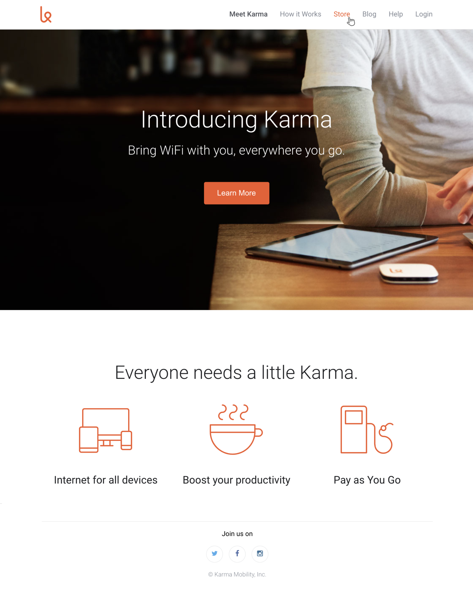

# karma-clone

The aim of this exercise is to create a page that looks just like this one: 

### Set up

First step is to clone this repo.

# Instructions

 - **Edit `index.html` and `style.css`** to re-create the design above.
   - Remember, use semantic HTML to re-create the structure, and style each element using CSS to make a perfect copy of the above image. 
   - All the images and icons you need can be found in the `img` folder, and the font 'Roboto' is already loaded into the project. 
   - **Only create the desktop design** for now. 

### Submitting your work
 - **Commit and push your code often** (for example every half an hour)so you get into the habit and you avoid losing any code that you write if your machine crashes for example. 
 - Once you're ready to submit your homework for review, do a final push and **create a Pull Request**.

